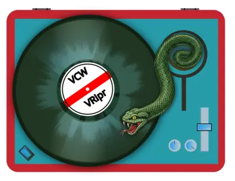

<p align="center">
  
</p>

<h1 align="center">VCW - The Vinyl Capture Workstation</h1>

<p align="center">
  Drop the needle. Everything after that is ours.
</p>

<p align="center">
  
  
  
  
  <a href="https://github.com/shunte88/vcw/actions/workflows/ci.yml">
    
  </a>
  
</p>

<p align="center">
  <a href="https://www.buymeacoffee.com/shunte88">
    
  </a>
</p>

---

A record is an analogue object with one good side at a time and no undo. The software
that digitises it should be as careful with the signal as the cartridge tracking the
groove, and most of it is not: it resamples when you did not ask, it dithers to be
helpful, it calls 24-bit "high resolution" and hands you a float. VCW does none of
that. What the converter put on the wire is what lands in the project, and what is in
the project is what comes out the other end - verified byte for byte, not asserted in
a changelog.

Arm the deck, watch the needle on a 50 Hz meter that is live before you record so you
can actually set the level, drop the stylus, and let it run. VCW writes every frame
to a transactional project file as it arrives, so a power cut costs you the last
quarter second and nothing else. When the side ends it finds the track boundaries,
fingerprints them, asks Discogs, MusicBrainz and AcoustID who the record is, lets you
argue with the answer on a waveform you can drag, and exports tagged FLAC, WAV, MP3 or
Ogg with the cover art attached and the file names you asked for.

One application, one file per record, no scripting pipe, no second program in the
loop. It records.

## What it does

- **Captures** at any rate from 44.1 to 192 kHz and any depth the device offers, with
  no resampling, no dithering and no hidden gain. `vcw doctor` tells you what your
  hardware will really do before you commit a side to it.
- **Survives.** The project is a SQLite database written as the audio arrives. Kill
  the process mid-side and `vcw recover` finishes it the way the writer would have.
- **Finds the tracks** by silence, by fingerprint and by the release's own track list,
  and shows you the boundaries on a waveform you can scrub, drag and audition.
- **Identifies the record** through Discogs, MusicBrainz and AcoustID, catalogue
  number first, resolving the disagreements rather than taking the first answer.
- **Exports** FLAC, WAV, MP3 and Ogg with full tags, multi-value genres and artists,
  embedded and sidecar cover art, and a naming template you control.
- **Reads Audacity**, AUP3 and AUP4, so a decade of existing rips comes in whole.
- **Runs headless.** The desktop window and the `vcw` CLI drive the same core, so a
  side can be recorded, recovered and exported with no UI compiled at all.

VCW is part of the VRipr family and the successor to
[VRipr](https://github.com/shunte88/vripr), which analysed rips Audacity had already
made. VCW does the recording itself: the capture path, the project store and the export
are all its own, and Audacity becomes something it reads rather than something it depends
on. The family is why the label on the record in the application's own artwork is printed
VCW / VRipr.

- **Requirements:** [REQUIREMENTS.md](REQUIREMENTS.md)
- **Delivery plan:** [PROJECT_PLAN.md](PROJECT_PLAN.md)
- **Project format:** [docs/SCHEMA.md](docs/SCHEMA.md) (generated from the schema)
- **Spike findings:** [docs/spikes/](docs/spikes/)

## Status

0.1.1-alpha. It records, it identifies, it exports, and it packages for all four
targets. What follows is the long version: every work package, what it proved, and
what it is still waiting on. The spikes that came first:

| Spike | Question | State |
|---|---|---|
| S1 | Does CPAL give us bit-perfect capture and playback per platform? | [Linux yes](docs/spikes/S1-cpal-capture.md), on stock CPAL 0.18; other platforms outstanding |
| S2 | Can SQLite absorb sustained 24/192 capture, and survive a kill? | [yes on x86_64/SSD](docs/spikes/S2-sqlite-capture.md), incl. a 90-min soak; other platforms outstanding |
| S3 | Will Tauri IPC carry the meter and waveform rates? | [yes, with 12.5× headroom](docs/spikes/S3-tauri-ipc.md), incl. a 30-min soak - the constraint is main-thread *rendering*, not IPC |
| S4 | Does `chromaprint-next` fingerprint from a stream? | [yes, bit-identically](docs/spikes/S4-chromaprint-streaming.md); region boundaries need no accuracy |
| S5 | Is the Audacity project format readable? | [yes, AUP3 *and* AUP4](docs/spikes/S5-audacity-format.md) - 30/30 corpus projects parsed to the last byte; the AUP3->AUP4 audio layer is byte-identical across five matched pairs |

Full snapshot - what is proven, what is assumed, what is waiting on hardware or a
decision - in [docs/STATUS.md](docs/STATUS.md).

Phase 1 has started. The workspace scaffold (WP-01) is in place: eleven `vcw-*` crates
under `crates/`, a four-target CI matrix, and the licence and toolchain gates. Schema v1
(WP-02) is built and [documented](docs/SCHEMA.md); device enumeration (WP-03) and
capture (WP-04) are built on Linux x86_64, with Windows and macOS still unverified.
The persistence writer (WP-05) is built, so a capture now lands in the project as
audio rather than only as a row - proven by a 90-minute 24/192 soak on ext4 at a
real-time factor of 1.00001, with zero loss, a 4.81 MiB write-ahead log, and all
6,220,949,760 sample bytes read back and matched against what the source must have
produced for that frame and channel.

Recovery (WP-06) is built, which closes the first milestone: **it records.** A capture
process killed outright leaves a project that `vcw recover` finishes the way the writer
would have - the blocks decide the length rather than the row that never got updated,
the end time comes from the last block that was actually committed rather than from the
clock, and audio stranded past a gap is refused rather than quietly dropped. The proof
is a suite that spawns a real capture, `SIGKILL`s it at a random point, recovers it,
and then recomputes every stored sample from the frame index in its own block: 94 kills
this session, every one recovered exactly, none of them losing more than the single
250 ms block that had not been committed yet.

The engine (WP-07) is built, and with it the transport: §11's state machine is a
*typestate*, so an invalid transition is not rejected at runtime but has no method to
call - `Idle` cannot stop, `Stopped` cannot record, and a `Paused` that has been
resumed no longer exists. What drives it is a command in and an event out, nothing
else, which is what lets `vcw session side-a.vcw --script "arm,record,sleep 30,stop"`
record a side with no UI compiled at all. That is the architectural rule in §2 being
tested rather than asserted: a core that could only be driven from the interface would
have leaked into it.

The meters (WP-08) read through that same transport. Peak, RMS, a peak-hold needle and
a clip latch, per channel, at 50 Hz, live from the moment the transport is armed rather
than from the moment it records - because the workflow sets the level before the needle
goes down and there is nothing to set it against otherwise:

```sh
vcw session side-a.vcw --script "arm,sleep 10,record,sleep 1200,stop" --meters
```

Two things about that are worth stating, because both were decisions. Full scale is
**asymmetric**: the largest positive 16-bit code decodes to 0.99997 and the most negative
to exactly -1.0, so a clip detector comparing `abs() >= 1.0` never fires on integer audio
at all, and VCW tests each end against its own limit. And the fan-out that feeds the
meter is **lossy on purpose** - a meter worker that falls behind drops what it cannot
hold and counts it, because a stalled consumer must never cost a recorded frame. The
capture path is unchanged by it: the audio callback still does three atomics and one
memcpy.

The waveform (WP-09) is the first thing to read a capture back rather than write one.
The pyramid is built as the audio lands - the writer summarises every 250 ms block as it
commits it - and the reader picks its own rung from the span and the width, so the
picture is always exactly as wide as it was asked for and never costs more than the zoom
implies.

Getting there found something in the storage layer that no amount of care in the renderer
would have fixed. A sample block at 24/192 is 192 KB of audio, so with a 64 KiB page it
occupies pages of its own, and reading the twelve bytes of summary beside it still costs
a page fault. A 26-minute side is 12,528 blocks: **784 MiB of reads to obtain 150 KB of
triplets, and 3.77 seconds** for a drawing that has to feel instant. Two covering indexes
put the coarse rungs somewhere the audio is not, for 1.4% of the file, and the same
drawing is **17 ms**. The query names them explicitly, because SQLite left to itself
prefers the primary key and produces the slow plan, and a test asserts on the *query
plan* rather than on a stopwatch - the difference it guards is two hundred fold, and a
timing test for it would still be flaky.

Both indexes are maintained on every commit, so the writer was re-measured rather than
assumed: a 90-minute real-time 24/192 soak with the new schema gives a worst commit of
**102.6 ms against the 102.3 ms** the schema without them gave, over 21,601 commits,
with zero loss and all 6,220,938,240 bytes matched. The visible cost is 1.4% of the file
and 15% more write-ahead log.

The numbers are from a real record, not a generated signal: a 26-minute 192 kHz stereo
side pushed through the writer onto ext4, 300,627,479 frames in 2.33 GiB, with the page
cache evicted before every read. Whole side at 4000 columns 17 ms; an eight-minute span
at 1920 columns 74 ms; ten seconds 5.7 ms; the individual samples 6 ms. Worst case
anywhere in the sweep 304 ms.

Capture has been confirmed bit-perfect end to end on this machine: 96 kHz / 2 ch / S32
requested and granted in exclusive mode over a direct hardware path, cross-checked
against what the kernel says the card is actually running. That cross-check is the
point - the audio API's report of its own success is not evidence, and on the same card
through a converting path the claim is correctly refused.

Playback (WP-10) closes the second milestone: **it plays back.** Capture, waveform,
playback and seek all run headless:

```sh
vcw play side-a.vcw --capture 1                          # the whole capture
vcw play side-a.vcw --start 65 --end 130                  # a region
vcw play side-a.vcw --track 3                             # one track
vcw play side-a.vcw --boundary 65.4                       # 3 s either side of a boundary
vcw play side-a.vcw --render out.raw --start 0 --end 5     # no device needed
vcw play side-a.vcw --script "play, sleep 2, seek 15, skip-back, stop"
```

There is **no resampler**, and that is a feature
([ADR-0006](docs/adr/0006-playback-rate-policy.md)). A capture plays at its own rate or not
at all, and a device that cannot do 192 kHz is told so by name rather than handed a
silently converted side. The format preference is the opposite of capture's: capture
takes the best the device offers because a better capture is strictly better, while
playback takes whatever matches the bytes on disk, because anything else is a conversion
and a converted path is not bit-perfect however good it sounds. It says which it was.

Seeking is the part that had to be designed rather than written. The queue between the
reader and the audio callback is not a byte ring but **chunks tagged with an epoch**: a
seek bumps the epoch and the callback discards everything that no longer matches,
unplayed, instead of the listener hearing out the second of old audio a ring would still
be holding. Two useful things fall out of it for nothing - the reported position is the
frame the callback has in its hand rather than a guess with the buffer subtracted, and
running out of audio at the end of a side is distinguishable from running out in the
middle of one, which is the difference between "finished" and "your machine is too busy".

It is measured both ways. Byte-for-byte in CI with no sound card, because `--render`
drives the same queue and the same callback synchronously, so playing two seconds and
then seeking to four must produce exactly the first two seconds followed by everything
from the fourth: nothing repeated, nothing missing. And on a real device, where a seek
reaches the converter in a **median 19.8 ms**, one chunk. Getting there cost two findings
that only a device could have produced: a queue shallower than one hardware buffer
underruns on every single callback while every counter except that one reports health,
and a seek needs the reader to be holding an empty buffer at the moment it lands or it
costs a buffer of silence however fast everything else is.

Detection (WP-11) closes the third milestone: **it finds tracks.** VRipr's three
detectors - RMS energy, spectral flatness and an adaptive HMM - are ported into
`vcw-signal`, and the port is measured rather than asserted: over all 595 snippets of
the labelled corpus it reproduces **97.6% to 99.7% of VRipr's own boundaries, every
agreement at the identical frame**, and the residue comes down to one documented
rounding difference.

The shape of the port is different from the original, though, and deliberately. VRipr's
detectors take a file and decode it; VCW's take feature frames, because §22 asks for
analysis *while the record is still turning* and there is no file yet. So there are two
passes over the same extractor: a live one on a lossy tap of the capture stream, levels
only, publishing a marker about 1.2 s behind the needle and never retracting one; and a
post-capture one that reads the committed side back, runs all three detectors over one
spectral extraction, and resolves what they say.

Nothing is decided by a detector. Each publishes an *observation* carrying position,
confidence, provenance and the measurements behind it (§23, §24), and a resolver turns
those into decisions - counting agreement rather than multiplying it, refusing to move a
boundary a person placed, and erring towards clipping silence rather than music. It
matters on real records: on a 26-minute side the HMM reports 266 boundaries and the
other two detectors report six, so what the resolver says is that six of them have a
second witness and 264 do not.

```sh
vcw detect side-a.vcw --min-sources 2      # boundaries a second detector seconded
vcw detect side-a.vcw --evidence --json    # every measurement behind every boundary
```

Nothing there writes a track, and §23 is the reason: an analysis subsystem publishes
what it saw, and a project decides what to do about it. Deciding is WP-13's, below.

Metadata (WP-12) is the first part of the product that reaches outside the machine, and
the interesting requirement is §40: the application stays **fully usable with networking
disabled**. That is met as a property of the build rather than as a flag. Only a
`Transport` can perform I/O, `Offline` is the default, and the HTTP agent lives behind a
`net` feature - so `cargo test -p vcw-metadata --no-default-features` passes with no HTTP
code compiled at all, and it is part of the gate. Above the transport a `Client` owns the
request path in one fixed order, **cache, then rate limit, then retry, then timeout, then
cancel**: a cached answer must not spend a rate-limit slot, or a warm cache is slower than
a cold one. Above that, a `Provider` knows one service's grammar and nothing about time or
the network.

```sh
vcw metadata search --artist Autechre --album Amber --provider musicbrainz
vcw metadata fetch bd5b1270-7468-47f0-9c9a-928199f9e4ad     # sides A-D, 11 tracks
vcw metadata genres "HH; ambient techno; Mn"                # Hip-Hop; Hip Hop; ambient techno; Minimal
```

§32's genre normalisation is ported from VRipr and held to VRipr's *output*: 1,819
recorded answers, produced by a verbatim copy of the original running out of tree, all
reproduced. Doing it that way found a nondeterminism the original shipped - five genre
keys collide under case folding with differing answers, resolved there by hash order and
here by file order. §39's rule about credentials is a design constraint rather than a
check: the Discogs token travels in an `Authorization` header, never in the query string,
because the URL is the cache key, the log line and the thing that ends up in a bug report.

The vinyl data model (WP-13) is where a detection becomes a record. Schema v2 adds the
release, its artwork, its sides and their boundaries, and **a track is its two
boundaries** - the `tracks` table has no frame columns at all, so moving a boundary moves
whatever it bounds and there is no second copy of the position to disagree. There is no
`discs` table either: side index 2 *is* disc 2's first face, by arithmetic, and a row
would be a second place to store one fact. `releases.discs` is the operator's claim and
the side rows are the reality, so the gap between them is the answer to what still needs
recording.

```sh
vcw tracks side-a.vcw adopt --side A --min-sources 2 --dry-run   # 270 found, 6 seconded
vcw tracks side-a.vcw split 1 --at 140.0
vcw tracks side-a.vcw set 1 --title "The Rainbow" --confirmed
vcw tracks side-a.vcw lock 4                                     # analysis may not move it
vcw tracks side-a.vcw list --boundaries
vcw release side-a.vcw set --artist "Talk Talk" --title "Spirit of Eden" --discs 1
```

Every edit is non-destructive, and that is asserted rather than intended: a test
fingerprints every byte of both audio tables, runs fifteen editing verbs through it, and
requires the fingerprint unchanged after each one - having first proved the fingerprint
notices a single altered sample. §24's lock gets the same treatment. A boundary a person
places survives a second detection pass configured to disagree with the first, which is
the whole loop - read the project's boundaries back as prior observations, resolve them
against what the detectors now say, write the result under a promotion policy - and not
one function tested in isolation. The policy's default is the conservative one, two
detectors or it does not become a track, because on a real side the HMM reports 270
boundaries where the other two detectors second 6.

What a lock binds is *analysis*, not the person who set it: `merge` still joins two
tracks across a locked boundary and leaves the boundary behind as a marker of where the
join was, and an operator can always overrule a lock - at which point the boundary
becomes theirs, since whoever overrides a lock is the new author of that position.

Export (WP-14) is where a project becomes files. It reads committed blocks and edit
instructions and writes nothing back - the project is opened **read-only**, because a
crash mid-export must not endanger the one thing in it that cannot be redone. A track's
audio is the span between its two boundaries and nothing else: no fade, no lead-in, no
gap trimming, so the bytes written are the bytes recorded. That is asserted and not
asserted loosely: a test records a known pattern, cuts it at frames deliberately not
block-aligned, and compares each exported WAV's data chunk against the exact slice of
what went in, for three stored formats and for four channels as well as two.

```sh
vcw export side-a.vcw --into ~/rips --format flac
vcw export side-a.vcw --into ~/rips --side A --dry-run --json
vcw export side-a.vcw --into ~/rips --template "{album_artist}/{year} - {album}/{tracknum} {title}"
```

`plan` resolves every track to a path, a span and a set of tags before a single byte is
written, so an unknown template token, two tracks that want the same filename, and a file
already on disk are all reported up front - an export is minutes of work over gigabytes,
and a collision found at track nine is found too late. `--dry-run` is what falls out of
that for free.

The naming templates are VRipr's, token for token, with its sanitisation rule corrected.
The original substitutes first and cleans the assembled path afterwards, so a provider's
`AC/DC Medley` becomes a directory called `AC`, and its cleaner never touches `..`. Here
the values are cleaned *before* they go into the template, which is what keeps the `/`
an operator typed into `{album}/{title}` - a directory they asked for - apart from a `/`
that is just a character in somebody's title.

Tags are VRipr's conventions too - a multi-value field is written as separate items
rather than one string with a separator, and where the canonical Vorbis key differs
from VRipr's, both are written (`LABEL` and `ORGANIZATION`, `RELEASECOUNTRY` and
`COUNTRY`), so a library built with the old tool keeps its shape. Artwork defaults to
both places at once: one image beside the tracks, as VRipr did, *and* embedded in every
file, which VRipr never did.

Tags are validated by software nobody here wrote - `ffprobe`, `flac`, `metaflac` and
python `mutagen` - and a tag write is required not to move a sample: the FLAC stream's MD5
must be unchanged after tagging, and the WAV `data` chunk byte-identical. Two limits are
refused out loud rather than worked around. A WAV cannot exceed 4 GiB, because RIFF sizes
are 32-bit. And `flacenc` 0.5.1 stops at 24 bits and 96 kHz, which are the library's
limits and not the format's - so a 32-bit capture has no FLAC path today, and narrowing it
silently is not on offer, because a real 32-bit rip uses the whole low byte and dropping
eight of them is a decision about dither that belongs to a person. **MP3 and Ogg are not
built yet.**

The desktop shell (WP-15) puts a window in front of all of it. There is now an eleventh
crate, `vcw-contract`, which is the typed command and event surface: every unit is
resolved on the Rust side, so a view is handed `A3`, its seconds and its confidence
rather than the arithmetic that produces them. The shell itself lives in `app/`, a cargo
workspace of its own, which is what makes the rule *core crates have zero Tauri
dependency* true by construction rather than by discipline - `cargo tree --workspace` at
the repository root cannot reach Tauri, and CI fails if it ever can. The TypeScript the
frontend compiles against is generated from those Rust types and committed, with a test
that fails when the two disagree.

The interface (WP-16) is what fills that window: eleven panels - project browser, capture
workspace, transport, meters, waveform, track editor, metadata browser, export, settings,
diagnostics and help - and a keyboard map that covers all twenty of §44's workflows, so
none of them needs the mouse. Two rules hold it together. Nothing is computed in
TypeScript: a panel renders the view models the contract already resolved, and where a
component was caught doing arithmetic on a sample rate the field moved into Rust rather
than the calculation being defended. And every keybinding is proved to reach something by
a test that reads the components' own source, because the type checker can prove the map
is complete without noticing that four of its entries did nothing - which is exactly what
it had been doing. The window compiles and is fully wired; it has not yet been driven
through a real capture by hand.

## Layout

```
crates/          the product - one crate per REQUIREMENTS §6 group, §6's leaves
                 as modules. See docs/adr/0003-workspace-layout.md
crates/contract/ the typed command, event and view surface (§35) - what the shell
                 and `vcw --json` both answer with, so neither computes a unit twice
app/             the desktop shell: a separate workspace, so the product's own
                 workspace tree cannot reach Tauri. `app/src-tauri` is the Rust
                 side, `app/ui` the React frontend, and
                 `app/ui/src/bindings/vcw.d.ts` is generated - do not edit by hand
spikes/          Phase 0 evidence, a separate workspace, excluded from the product
docs/SCHEMA.md   the .vcw schema, generated - do not edit by hand
docs/adr/        architecture decision records
docs/spikes/     the S1-S5 write-ups
```

Every source file opens with a header block: the file name, the product line, the
copyright, a one-line statement of what the file is for, and the MIT text. It is in
whatever comment syntax the language uses - `/* */` for Rust, TypeScript and HTML, `#`
for shell and Python, below the shebang where there is one. The purpose line repeats
the file's own first doc line (`//!` in Rust), which is where the real explanation
lives.

## Building

```sh
cargo build --workspace     # the product
cargo test --workspace
cargo run -p vcw-cli -- doctor
```

`vcw` is the headless driver - §4.5 requires the whole workflow to be drivable without a
UI. Today it can answer what this machine will record, and record from it:

```sh
cargo run -p vcw-cli -- devices --which input --hardware
cargo run -p vcw-cli -- formats "hw:CARD=0,DEV=0" --which input --confirm
cargo run -p vcw-cli -- capture "hw:CARD=0,DEV=0" --rate 96000 --seconds 10
```

`devices` lists what the host advertises; `--hardware` keeps only the direct paths that
could be bit-perfect. `formats` shows the §8 configurations one device offers, and
`--confirm` opens it once per configuration to find out which of them are real - an
advertisement is not a promise, and on an ALSA plug device most of them are not.

`capture` opens the device, reports what was asked for beside what was granted, reads
the format back from the operating system, and says whether the result can honestly be
called bit-perfect. It refuses the claim rather than guessing:

```
  negotiated  96000 Hz, 2 ch, S32, exclusive, direct hardware, buffer backend default
  os says     confirmed by /proc/asound/card0/pcm0c/sub0/hw_params: S32_LE 96000 Hz 2 ch
  counters    0 overruns, 0 underruns, 0 dropped frames, 0 stream errors
  verdict     bit-perfect, confirmed against the OS
```

Add `--project take1.vcw` to write the audio, the session and its diagnostics counters
into a project file. Without `--project` the samples are drained and discarded, because
there is nowhere to put them.

`soak` runs the same writer from a generated source for as long as you like, then reads
every byte back and checks it against the value the source must have produced for that
frame and channel:

```sh
vcw soak side-a-soak.vcw --rate 192000 --format s24 --minutes 90
```

That is how the storage path is measured on a machine before it is trusted with a
record. It reports commit latency percentiles against the block budget, the peak
write-ahead log, and whether anything was lost - and exits non-zero if it was.

`waveform` draws a capture at the terminal, which is how the pyramid is checked without
a UI:

```sh
vcw waveform side-a.vcw --pixels 160 --rows 21
vcw waveform side-a.vcw --start 300 --end 400 --pixels 1920 --json
```

It says which rung it read and how long the read took, so the claim above is verifiable
on any machine:

```
  capture    1, 192000 Hz, 2 ch, 1565.768 s
  span       0.000 s to 1565.768 s, 160 column(s) of 1878921.7 frame(s)
  level      block (48000 frame(s) a triplet), read in 17.600 ms
  channel 0  peak 0.9332
```

Add `--rebuild` to recompute the summaries from the stored audio first. It writes only
summaries, never samples, and only for blocks VCW recorded - an imported Audacity
project cannot be rewritten by a redraw.

`detect` runs the post-capture pass and shows its working:

```sh
vcw detect side-a.vcw
vcw detect side-a.vcw --adaptive --min-sources 2 --evidence
```

```
  analysis   15658 window(s), 3 detector(s), 12.839 s
  showing    6 of 270 boundary/ies, those 2 or more detectors reported
     1  start      0.000 s  conf 1.00  silence+spectral-change (2)
     2  end      282.800 s  conf 0.53  silence+spectral-change (2)
     3  start    283.800 s  conf 1.00  silence+spectral-change+hmm (3)
```

`--threshold-db`, `--adaptive`, `--min-silence` and `--min-sound` are the detector
settings; `--evidence` prints the measurements each boundary rests on. It opens the
project read-only and writes nothing, so a side can be examined while another one is
recording.

`metadata` asks the providers, and can be told not to:

```sh
vcw metadata credentials
vcw metadata search --artist Autechre --album Amber --limit 5 [--json]
vcw metadata search --offline --artist Autechre       # what refusing looks like
vcw metadata fetch bd5b1270-7468-47f0-9c9a-928199f9e4ad
```

```
  musicbrainz  2 candidate(s)
     1  Autechre - Amber   1994  Warp  WARPLP25   GB  2LP  [bd5b1270-...]
```

`credentials` reports what is configured and never what it is. `fetch` guesses the
provider from the shape of the id. Credentials come from the environment only, never from
a project file: `VCW_DISCOGS_TOKEN` for Discogs, and `VCW_CONTACT` for the
self-identifying User-Agent both services ask for.

Requires a Rust toolchain at 1.90 or newer and, on Linux, `libasound2-dev`. SQLite is
compiled in, so there is no system SQLite to match.

### The desktop shell

The shell is its own workspace, so the commands above do not touch it and `cargo build
--workspace` at the root needs no webview at all. It needs node 22 and pnpm, and on Linux
`libwebkit2gtk-4.1-dev`, `libgtk-3-dev`, `libayatana-appindicator3-dev` and
`librsvg2-dev`:

```sh
cd app/ui && pnpm install && pnpm build   # the frontend must exist before the Rust build
cd ../src-tauri && cargo run              # or `cargo tauri dev` for a live reload
```

`tauri-build` fails the Rust build when `frontendDist` is missing, which is why the
frontend goes first. A release build must keep the `custom-protocol` feature on - it is
in the default set, and it is what tells Tauri it is not a development build; without it
the binary loads `devUrl` and opens on a blank page.

The TypeScript declarations the frontend compiles against are generated from the Rust
types in `crates/contract` and committed, so `app/ui` typechecks with no Rust toolchain
present. After changing a command, an event or a view model:

```sh
VCW_BLESS=1 cargo test -p vcw-contract --test bindings   # rewrite the declarations
cargo test -p vcw-contract --test bindings               # and the drift check passes
```

CI runs the same test and then `git diff --exit-code` over the generated file, so a
regenerated-but-uncommitted contract fails the build rather than reaching a frontend that
believes something else.

The spikes build separately:

```sh
cd spikes && cargo build --workspace
```

## Licence

MIT - see [LICENSE](LICENSE). VCW's own source is MIT without qualification. The
shipped binaries additionally link Chromaprint (LGPL-2.1-or-later) for fingerprinting
and, when the optional `mp3` feature is on, LAME (LGPL-3.0); the relink instructions
both licences require, and every other third-party obligation, are recorded in
[THIRD-PARTY-NOTICES.md](THIRD-PARTY-NOTICES.md). `cargo deny` enforces the licence
allowlist in CI, so a dependency with incompatible terms fails the build rather than
reaching a release.

## Attribution

If VCW's functionality is leveraged within your own solution - its code, its project
format, its capture or export paths, or a derivative of any of them - quote the
attribution. The MIT licence requires the copyright notice and permission text to
travel with the code; beyond that, a visible credit is simply the decent thing:

> Built on [VCW - The Vinyl Capture Workstation](https://github.com/shunte88/vcw),
> (c) 2026 Stue Hunter, MIT licensed.

If you publish something built on VCW, say so in your README and link back. If you
ship a change that is worth having, open a pull request so the next person gets it too.

## Like The App - Git The Shirt

Team Badger shirts and other goodies are available at [shunte88](https://www.zazzle.com/team_badger_t_shirt-235604841593837420)
